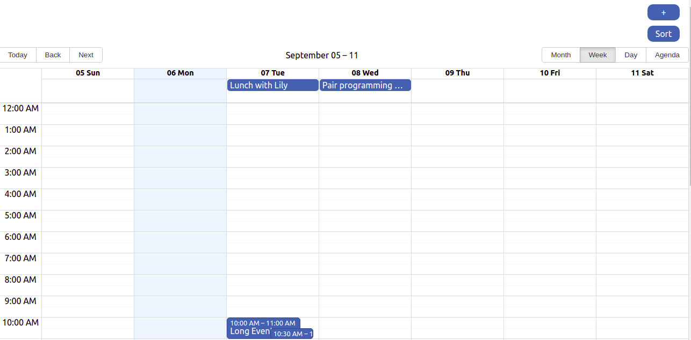
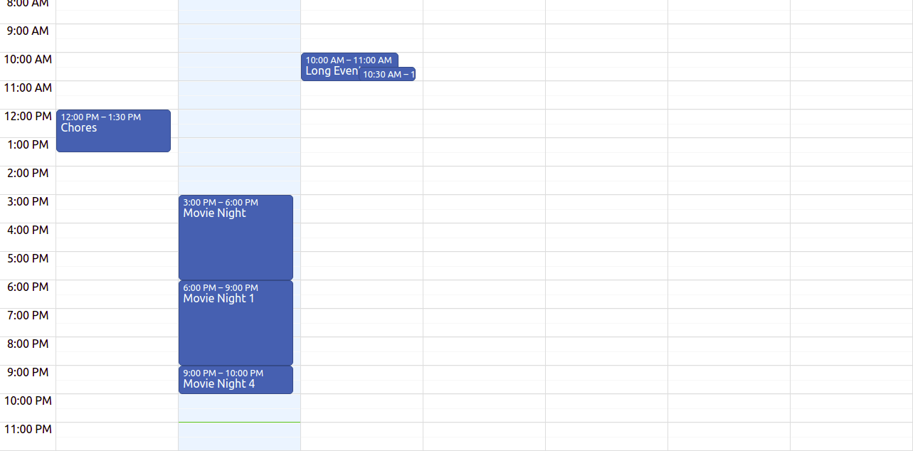

# EventHandler

**Número da Lista**: x<br>
**Conteúdo da Disciplina**: Greedy<br>

## Alunos
|Matrícula | Aluno |
| -- | -- |
| 17/0013651  |  João Gabriel Antunes |
| 16/0132550  |  Lorrany Azevedo |

## Sobre 
Neste projeto nós implementamos um organizador de tarefas.

## Screenshots



## Instalação 
**Linguagem**: Javascript<br>
Para rodar o projeto basta ter o instalador de pacotes npm instalado em sua máquina.

## Uso 
Para rodar o projeto basta executar os seguintes comandos no terminal:

```console
cd event-handler 
npm install
npm start
```

## Outros 

